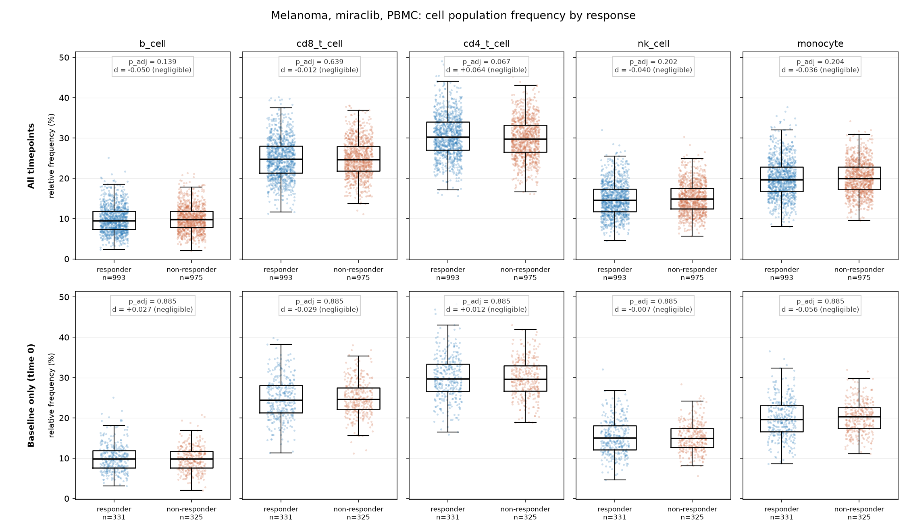

# Cell count analysis and dashboard

A SQLite database, a Python analysis pipeline, and a Streamlit dashboard built
over immune cell count data from a set of clinical trial projects.

The input is `cell-count.csv`. One row per sample, with subject and treatment
metadata and raw counts for five cell populations: b_cell, cd8_t_cell,
cd4_t_cell, nk_cell, monocyte. The pipeline loads that CSV into a normalized
schema, computes relative frequencies, compares treatment responders against
non responders, and writes the results to `outputs/`.

## Running it in a GitHub Codespace

Open the repo in a Codespace, then run three commands in the terminal.

```
make setup
make pipeline
make dashboard
```

`make setup` installs the packages in `requirements.txt`.

`make pipeline` runs `python load_data.py` and then `python run_analysis.py`.
The first builds `cell_count.db` in the repo root. The second reads that
database and writes the files under `outputs/`.

`make dashboard` starts Streamlit bound to `0.0.0.0` in headless mode. Codespaces
only forwards a port if the server listens on all interfaces, and headless mode
stops Streamlit from trying to open a local browser and from prompting for an
email address on first run. When it starts, a notification appears offering to
open the forwarded port. Click "Open in Browser". If you miss it, go to the Ports
tab next to the terminal, find port 8501, and click the globe icon. The port is
private to your Codespace by default.

The pipeline is safe to rerun. `load_data.py` deletes and rebuilds the database
file, and `run_analysis.py` overwrites the files in `outputs/`. Running
`make pipeline` twice gives the same database and the same outputs as running it
once. Both the database and `outputs/` are committed, so a grader can read the
results without running anything.

## Results

Every number below is read from the files in `outputs/`, which `make pipeline`
regenerates.

### Part 2, relative frequencies

Each sample is expressed as the percentage each population contributes to that
sample's total count. The full table is `outputs/summary_frequencies.csv`,
52,500 rows covering 10,500 samples. The first five rows:

| sample | total_count | population | count | percentage |
| --- | --- | --- | --- | --- |
| sample00000 | 93214 | b_cell | 10908 | 11.7021 |
| sample00000 | 93214 | cd4_t_cell | 20491 | 21.9827 |
| sample00000 | 93214 | cd8_t_cell | 24440 | 26.2192 |
| sample00000 | 93214 | monocyte | 23511 | 25.2226 |
| sample00000 | 93214 | nk_cell | 13864 | 14.8733 |

### Part 3, responders against non responders

No cell population separates responders from non responders. At baseline, none
of the five populations is significant after Benjamini-Hochberg correction, the
smallest adjusted p value being 0.885, and every effect size is negligible,
the largest absolute Cliff's delta being 0.0564 against a negligible threshold of
0.147. The same holds in the all timepoints run. This is a clean negative
result, not an inconclusive one.

Baseline comparison, 331 responder and 325 non responder samples from
331 and 325 subjects. Subject counts are not shown because at baseline
there is one sample per subject, so they equal the sample counts. Full columns,
including the U statistic and the subject counts, are in
`outputs/responder_stats_baseline.csv`. The other run is in
`outputs/responder_stats_all_timepoints.csv`.

| population | n_yes | n_no | median_yes | median_no | median_diff | cliffs_delta | magnitude | p_value | p_adj | significant |
| --- | --- | --- | --- | --- | --- | --- | --- | --- | --- | --- |
| b_cell | 331 | 325 | 9.785 | 9.758 | +0.027 | +0.0271 | negligible | 0.5484 | 0.8852 | False |
| cd8_t_cell | 331 | 325 | 24.396 | 24.601 | -0.205 | -0.0295 | negligible | 0.5138 | 0.8852 | False |
| cd4_t_cell | 331 | 325 | 29.634 | 29.530 | +0.103 | +0.0117 | negligible | 0.7963 | 0.8852 | False |
| nk_cell | 331 | 325 | 14.997 | 14.890 | +0.107 | -0.0065 | negligible | 0.8852 | 0.8852 | False |
| monocyte | 331 | 325 | 19.606 | 20.286 | -0.680 | -0.0564 | negligible | 0.2115 | 0.8852 | False |

nk_cell reports a positive median difference alongside a negative Cliff's delta.
That is legitimate rather than an error. The "Effect size and n are always
reported" subsection below explains how a pairwise dominance statistic and a
single percentile can point opposite ways.



The figure shows both runs. Which of the two is the defensible primary analysis
is covered in "Which of the two runs is primary" below.

### Part 4, baseline cohort subsets

The baseline cohort is melanoma subjects on miraclib with PBMC samples at time
0: 656 samples from 656 subjects, one sample each. The b_cell mean
in the last row is the exception, taking all sample and treatment types.

| Question | Answer |
| --- | --- |
| Samples per project, baseline cohort | prj1 384, prj2 0, prj3 272 |
| Subjects by response, baseline cohort | no 325, yes 331 |
| Subjects by sex, baseline cohort | F 312, M 344 |
| Mean b_cell, melanoma males, responders, time 0 | 10206.15 cells (mean relative frequency 9.99%) |

prj2 is present at zero rather than omitted. Its melanoma and miraclib subjects
were all sampled as whole blood, which the PBMC filter excludes.

## Database schema

`sql/schema.sql` defines eight tables and three views. The schema drops every
object it owns before creating it, which is what lets the loader rebuild from
scratch.

Lookup tables: `projects`, `conditions`, `treatments`, `cell_populations`. Each
holds a surrogate id and one distinct label.

`subjects` holds the facts that belong to a person: project, condition, age,
sex. One row per subject.

`treatment_courses` holds one row per subject per drug, with the response on it.

`samples` holds one row per aliquot, keyed to a course, with a sample type and a
timepoint.

`sample_counts` holds one row per sample per population, in long format.

### Why normalized, and why long format

The obvious alternative is one wide table that mirrors the CSV, one row per
sample with five count columns. That works at the current size. It does not hold
up as the study grows toward hundreds of projects and thousands of samples.

A wide table repeats every subject level fact on every row. Age, sex, condition
and project are stored once per sample rather than once per subject. Today that
is three copies of each subject. It is also three chances to disagree. If one
row says a subject is male and another says female, there is no way to tell
which is right, and a `GROUP BY sex` quietly produces a wrong answer. In the
normalized schema those facts live in `subjects`, so they cannot disagree. The
loader also checks this before inserting anything, and fails with the column
name if a subject level value varies within a subject.

The lookup tables give the same guarantee for labels. A wide table stores the
string `melanoma` on every row, so `Melanoma` or a trailing space is one typo
away from a filter that silently returns zero rows. With a foreign key into
`conditions`, a misspelled condition fails the insert instead of producing a
plausible looking empty result.

Long format for the counts matters most for growth. A sixth population means a
new row type in `sample_counts`, not a schema migration, not a new column, and
not a rewrite of every query that enumerates columns. Analysis code written
against long format works unchanged. Wide format forces `ALTER TABLE` on a
growing table and forces every downstream query and plot to learn the new name.
Long format also makes the aggregate that matters, the per sample total across
populations, a single `SUM` grouped by sample, rather than a hand written sum of
five named columns that has to be edited every time the panel changes. The cost
is that the counts table is five times as many rows, and that a query joins
rather than reads one row. At 52,500 rows on the current data that cost is
invisible, and the indexes on the join keys keep it flat as the table grows.

Storage matters at scale too. Growing from the current 10,500 samples toward
hundreds of thousands multiplies the repeated metadata in a wide table by the
same factor. In the normalized schema, adding samples adds rows to `samples` and
`sample_counts` only. The subject and course rows stay as they are.

### Scaling to many projects and many kinds of analysis

`sql/schema.sql` creates nine indexes, and each one exists for a query shape the
analysis actually uses.

Three sit on `subjects`. `idx_subjects_project` and `idx_subjects_condition`
serve the filters that open almost every cohort, narrowing to one project or to
melanoma before any join runs. `idx_subjects_sex` serves the Part 4 breakdown
and the male filter on the final question.

Three sit on `treatment_courses`. `idx_courses_subject` supports walking from a
subject to the drugs they were given, which is the direction the sample join
takes. `idx_courses_treatment` supports the reverse, pulling every subject on
miraclib. `idx_courses_response` supports splitting a cohort into responders and
non responders, which Part 3 does twice.

Two sit on `samples`. `idx_samples_course` carries the join from a course down to
its aliquots. `idx_samples_type_time` is a composite on sample type and
timepoint together, because the cohort filters never ask for one without the
other. PBMC at time 0 is a single index lookup rather than a scan with a
predicate.

The last one, `idx_counts_population`, is composite on `sample_counts` with
`population_id` first and `sample_id` second. The column order is the point. The
common access pattern is one population across many samples, comparing b_cell
across a cohort, not all five populations of one sample. Leading on population
turns that into a contiguous range read.

Several analyses the assignment does not ask for need no migration to support.
Longitudinal change within a subject works because samples are keyed to a course
and carry their own timepoint, so tracking one subject across timepoints 0, 7 and
14 is a filter and an order by, not a reshape. Cross project and cross condition
comparison works because both are subject attributes behind lookup tables, so
grouping by either is a join already indexed. Response prediction for a drug
other than miraclib works because `treatment_courses` is one row per subject per
drug rather than an assumption that a subject has one drug, so a second course
for the same subject needs no new table.

A new measurement type is cheap for the same reason long format is. A cytokine
panel, or a different assay on the same aliquots, is a new row in
`cell_populations` and rows in `sample_counts`, or at most a sibling counts table
keyed on the same `sample_id`. No existing table changes and no existing query
breaks, because nothing in the analysis enumerates population columns by name.

It does not scale forever. `v_analysis` is a view, so it is recomputed on every
query, and the per sample window function that produces `total_count` and
`percentage` is cheap at this size but not free. At thousands of samples across
hundreds of projects, the move is to materialize the frequency table during the
pipeline and index it. `run_analysis.py` is the right place for that, since it
already runs after the load and already writes derived files.

Past that point the constraint stops being the schema. The same DDL moves to
Postgres nearly unchanged, which buys concurrent writers and real query planning.
Beyond that the split is by workload rather than by size: analytics that scan
whole populations across every project, rather than filtering down to a cohort
first, belong in a columnar store fed from this one, with the relational database
kept as the system of record.

### Why response lives on treatment_courses

Response is an outcome of a subject being treated with a drug. It is not a
property of a tube of blood. In the CSV it is repeated on every sample row for
that subject, because the CSV is flat, but the repetition carries no extra
information.

Putting it on `treatment_courses` has three consequences that matter. First,
the same subject can appear on a second drug later with a different outcome,
and the schema already handles that without a new table. Second, a subject
cannot be a responder in one sample and a non responder in the next, because
there is only one place the value can be written. Third, counting responders
is a count of course rows, not a count of samples. On a wide table, `COUNT(*)
WHERE response = 'yes'` counts samples and silently overcounts subjects by the
number of samples each one has. That is a real and easy error, and moving the
column removes it at the source.

`response` is SQL NULL, not a string, for untreated subjects and for subjects
with no assessment. There are 474 such courses. NULL is the honest
representation of "not applicable" here, and SQL comparison rules mean those
subjects drop out of a responder filter instead of forming a third group by
accident.

### The three views

`v_sample_frequencies` is the Part 2 deliverable. It returns
`sample, total_count, population, count, percentage`, with those exact column
names. The total is a window function partitioned by sample, so the per sample
total and the percentage are computed in one pass rather than in a separate
aggregate and a join.

`v_sample_annotated` flattens a sample back out to readable labels: subject,
project, condition, treatment, sex, age, response, sample type, timepoint. It
undoes the joins so that filtering code does not have to repeat them.

`v_analysis` joins the two. It is the single entry point for the statistics, the
subset queries, and the dashboard. Every cohort filter in this repo is a `WHERE`
clause on this one view, which is why the cohort definitions stay consistent
between the pipeline and the dashboard.

Both frequency views are five rows per sample. Counting samples there needs
`COUNT(DISTINCT sample)` and counting subjects needs `COUNT(DISTINCT subject)`.
A bare `COUNT(*)` returns five times the number you wanted.

## Code structure

`load_data.py` is in the repo root and runs as exactly `python load_data.py`,
with no arguments. That is a requirement of the assignment, so it is not
negotiable, but it also suits the file. It is a one shot script, not a library,
and nothing else imports it. It resolves every path relative to its own
location, so it works no matter where it is invoked from.

The loader validates before it writes. It checks the header against the expected
column list, checks for duplicate sample codes, checks for nulls in required
columns, checks that subject level values do not vary within a subject, and
checks that a subject on one drug does not carry two different responses. These
are the same conditions the schema enforces with CHECK and UNIQUE constraints.
Checking them first means the error message names the offending column and row
instead of surfacing as a constraint violation in the middle of a bulk insert.

The loader rebuilds rather than upserts. It deletes the database file and
applies the schema fresh. That is the simplest thing that makes `make pipeline`
idempotent. There is no merge logic to get wrong, and no accumulated state from
a previous run. Surrogate ids are assigned in sorted order so two runs produce
identical ids, which means two runs produce comparable databases and not just
equivalent ones.

`src/analysis/` holds the query and statistics code, split by what it answers.
`frequency.py` computes relative frequencies. `stats.py` runs the responder
comparison. `subsets.py` answers the cohort and count questions. `plots.py`
draws the figure. Each function takes an open connection and returns a
DataFrame, so each one can be called from a test, from `run_analysis.py`, or
from the dashboard without changing anything. `run_analysis.py` is thin. It
opens the connection, calls those functions in order, and writes the files.
Keeping the analysis out of the entrypoint is what lets the tests assert on
return values rather than on parsing a CSV off disk.

The dashboard queries the database and never reads the CSV. This is deliberate.
The CSV has no constraints, so nothing stops a dashboard reading it from
grouping on a misspelled label or double counting subjects. Reading the database
means the dashboard gets the same validated data, the same NULL handling, and
the same cohort definitions as the pipeline, through the same views. If the two
read different sources, they will eventually disagree, and the disagreement will
show up as a number on a screen with no way to tell which one is wrong.

## Analysis decisions

### Mann-Whitney U, two sided

The responder comparison uses `scipy.stats.mannwhitneyu`, two sided, not a
t-test.

Relative frequencies are proportions bounded at 0 and 100. They are not normally
distributed, and several of the populations are skewed. A t-test assumes
normality and compares means, which makes it sensitive to the outliers that
proportion data produces. Mann-Whitney U compares distributions through ranks.
It does not assume a distribution shape and it is not moved by a single extreme
sample.

Two sided is the honest choice. There is no prior commitment to responders
having more of a given population rather than less, so testing in one direction
would be choosing the direction after seeing the data.

The tradeoff is small and quantifiable. Against a t-test on data that really
are normal, the asymptotic relative efficiency of Mann-Whitney U is 3/pi, about
0.955, so the rank test needs roughly five percent more samples to reach the
same power. At the group sizes here, 993 responder and 975 non responder samples
across all timepoints and 331 and 325 at baseline, five percent is negligible,
while the protection against a skewed distribution is not. The test also
treats samples as independent when subjects contribute more than one sample
across timepoints. The baseline only analysis exists partly for this reason: at
one timepoint per subject there is one sample per subject, so independence
holds.

### Benjamini-Hochberg across the five populations

Five populations are tested at once, so five p values come out. Reading them at
0.05 each inflates the chance of at least one false positive well past 0.05. The
correction is Benjamini-Hochberg via
`statsmodels.stats.multitest.multipletests(method="fdr_bh")`.

BH controls the false discovery rate, meaning the expected share of false
positives among the results called significant. Bonferroni controls the chance
of any false positive at all. Bonferroni is stricter and, across only five
tests, would be defensible. BH is the better fit here because this is an
exploratory screen across a panel, not a confirmatory test of one prespecified
hypothesis. The goal is a short list worth following up, and controlling the
proportion of that list that is wrong is the more useful guarantee.

Raw and adjusted p values are reported side by side in the output. Showing only
the adjusted value hides how much the correction moved, and showing only the raw
value hides that a correction happened. None of the five populations is
significant after adjustment, in either run.

### Effect size and n are always reported

Every row of the statistics output carries the median in each group, the median
difference, Cliff's delta, and n per group, alongside the p value.

A p value says how surprising the difference is under the null. It does not say
how large the difference is. With enough samples a difference too small to
matter clinically produces a small p value. With few samples a large difference
produces a large one. Reporting the p value alone invites both mistakes.

Cliff's delta is the effect size that matches the test. It is the probability
that a randomly chosen responder sample exceeds a randomly chosen non responder
sample, rescaled to run from -1 to 1, and it is computed from the same ranks
Mann-Whitney U uses. Pairing a rank test with a difference in means would mix
two different notions of "difference". The median difference is reported next to
it because it is in percentage points and is directly readable.

The two can disagree in sign, and that is not a bug. Cliff's delta is the
probability that a responder sample exceeds a non responder one minus the
probability that it falls below, taken over every pair of observations, while
the median difference compares a single percentile. When the two distributions
cross, the bulk of the pairwise comparisons can point one way while the midpoint
points the other, and both statements are true. The pipeline flags a sign
mismatch as a warning rather than an error, so a reader who spots one in the
output CSV knows it was noticed rather than missed.

n per group is reported because a result from a few dozen samples and a result
from a thousand deserve different amounts of trust, and because a cohort filter
that silently matched fewer rows than intended shows up immediately as a
surprising n. Both sample n and subject n are reported, since these differ
whenever more than one timepoint is included.

### Boxplots overlay individual points

The figure draws a box per group per population with every individual sample
plotted over it.

The groups here are large, several hundred samples per arm, so the reason is not
that a box drawn over few points overstates its own certainty. The reason is
that the result being reported is a near identical pair of medians, and a reader
has no way to judge that claim from two boxes alone.

Overlaying the points answers the question the boxes raise. Both distributions
are broad, unimodal and heavily overlapping, and they cover the same range at
the same density. That is what makes the near identical medians credible. Two
boxes with matching center lines could equally well come from a bimodal
distribution, from one arm with a long tail, or from a handful of extreme values
dragging a summary line into place. The points rule those out by showing that
the overlap is the whole shape of the data, not an artifact of summarizing it.

Each panel also carries its adjusted p value and its Cliff's delta with the
magnitude label, so the figure states the same result as the statistics table
rather than needing to be read next to it.

The tradeoff is overplotting. Points are jittered, drawn small and heavily
transparent, and the boxes are unfilled and drawn on top so the summary stays
readable through the cloud. At much larger n this approach does stop working and
a violin or a hex bin is the better move. At these sizes the raw points still
resolve.

### Cohort definitions

The responder comparison uses melanoma subjects on miraclib with PBMC samples.
That is 1,968 samples across 656 subjects. The baseline analysis adds the
constraint that the timepoint is 0, giving 656 samples.

The final Part 4 question, mean b_cell for melanoma males who responded at
baseline, deliberately has no sample type filter and no treatment filter. The
question asks across all sample and treatment types, so adding either filter
would answer a different question. That slice is 485 rows and the answer is
10206.15.

That answer is a raw count, not a relative frequency. The question asks for the
average number of B cells, and Part 4 queries the database and filters rather
than reading the Part 3 frequency summary, so raw counts are what it operates on
by design. The wording is ambiguous enough that the mean relative frequency over
the same slice is reported as a secondary number, which is 9.99.

Counting rules follow the wording. Samples per project counts samples, one per
row of `v_sample_annotated`, which holds one row per sample. It is not
`COUNT(*)` over `v_analysis`, where every sample appears five times, once per
population. Subjects by response and subjects by sex are `COUNT(DISTINCT
subject)`, because a subject contributing several samples is still one subject.

Samples per project reports prj2 as an explicit zero for the baseline cohort
rather than leaving the key out. Its melanoma and miraclib subjects were all
sampled as whole blood, which the PBMC filter excludes. A missing row reads like
a filter nobody checked, while a zero reads like a fact that was.

### Which of the two runs is primary

The baseline-only run is the defensible primary analysis. It uses one sample
per subject, so Mann-Whitney's independence assumption holds. The all-timepoints
run counts each subject three times, which makes its p-values anticonservative:
the test sees 1,968 observations where there are only 656 independent units.

The conclusion does not depend on which you trust, and that is the point worth
making. Even the anticonservative run, with its effective sample size inflated
roughly threefold, produces no population significant after correction for five
comparisons. The analysis most likely to manufacture a false positive did not
find one. Cliff's delta agrees across both runs, staying under 0.065 in all ten
comparisons against a negligible threshold of 0.147, and effect size does not
change with sample size.

cd4_t_cell is the one number a reader may over-read: raw p = 0.0133 in the
all-timepoints run. It does not survive correction (adjusted p = 0.067) and is
absent at baseline (p = 0.796). It is what pseudoreplication looks like.

### Part 3 runs on the summary table, not on full precision

Part 3 asks for the comparison "using the data reported in the summary table".
The summary table is `v_sample_frequencies`, which reports percentages rounded
to 4 decimals, so that is what the tests are given. Feeding them unrounded
percentages instead would answer the question from a different table than the
one the assignment names.

The rounding has a visible consequence. Across the Part 3 cohort it turns 1
exact tie into 172, and Mann-Whitney splits tied ranks, which is why several of
the published U statistics end in .5. `verify.py` runs the same tests both ways.
On full precision percentages it reproduces every sample and subject count,
every magnitude label and every significance flag exactly, and moves only the p
values. The largest movement is nk_cell at baseline, 0.8851654 on the summary
table against 0.8853281 at full precision, a difference of 1.63e-04 in the
fourth decimal. No conclusion in this analysis depends on it.

## Dashboard

Deployed dashboard: https://cell-count-analysis-01.streamlit.app

The hosted app sleeps after a period of inactivity. If it shows a wake screen,
give it about thirty seconds. It can also be run locally or in a Codespace with
`make dashboard`.

## Tests

The tests assert the loader invariants and the cohort sizes recorded in
`CONTRACT.md`. They cover the row counts in every table, the rule that response
is SQL NULL and never the string "nan", the rule that every subject has exactly
three samples, and the rule that running the loader twice leaves every count
unchanged.

Run them from the repo root.

```
pytest -q
```

They need `cell_count.db` to exist, so run `make pipeline` first, or at least
`python load_data.py`.

The numbers in the tests are copied from `CONTRACT.md`. If one fails, either the
code is wrong or the contract needs to change. Editing the expected number to
make a test pass defeats the point of having it.

### Independent verification

`pytest` checks that the pipeline is internally consistent. It cannot catch a
mistake the pipeline makes consistently, because the tests and the code read the
same database. `verify.py` covers that gap. It recomputes the assignment from
`cell-count.csv` by a separate route and diffs the result against the committed
files in `outputs/`.

```
python verify.py
```

It imports only pandas, numpy and scipy. It reads `cell-count.csv` directly, and
it never opens `cell_count.db`, never reads a `.sql` file, and never reads
`load_data.py` or `run_analysis.py`. Where a shortcut was available it takes the
longer way on purpose: Cliff's delta is counted pair by pair rather than derived
from the U statistic, and Benjamini-Hochberg is written out rather than imported.
So a bug in the loader, in a view, or in the analysis layer shows up as a
disagreement instead of being reproduced identically on both sides.

It compares 157,651 values: the count, per sample total and percentage of every
row of `summary_frequencies.csv`, every statistic in both responder tables,
every answer in `part4_summary.json`, and the full sample list of
`part4_baseline_cohort.csv`.

The two routes differ in one input on purpose. The pipeline feeds its tests the
percentages as the summary table reports them, rounded to 4 decimals, which is
what Part 3 asks for. `verify.py` feeds its tests full precision percentages
computed from the CSV, so that it stays independent of every decision the
pipeline makes rather than inheriting one of them. Small differences in
continuous values follow from that and are expected.

So not every difference is a failure. The script exits non-zero only when
something substantive differs:

- any count, cohort size or integer answer differs at all
- any magnitude label differs
- any significance flag differs
- any p value, adjusted p value, Cliff's delta or median differs by more than
  0.001 in absolute terms

Everything else is printed under a heading saying it is within tolerance and
expected from the rounding. On the current data that is where every difference
lands. Every sample count, subject count, magnitude label and significance flag
agrees exactly. The 61 continuous differences are all at most 1.63e-04, about
six times inside the tolerance, and the largest is the adjusted p value at
baseline.

The U statistic is reported but not gated. It is a rank sum on a scale of
`n_yes * n_no`, and rounding creates ties that move it by half a rank, so the
10 differences there run from 0.5 to 3.0. An absolute tolerance meant for a
probability says nothing useful about it. Cliff's delta is the same statistic
rescaled to the range -1 to 1, and it is checked against the tolerance, which is
the meaningful version of that comparison.

The script also reruns Part 3 on 4 decimal input as a secondary check. All 60
values there reproduce `outputs/` exactly to 1e-9, which is what confirms the
differences are the rounding and nothing else. That check prints and does not
affect the exit code.

It fixes nothing. See "Part 3 runs on the summary table, not on full precision"
above for why the rounding is the correct reading of the assignment.
